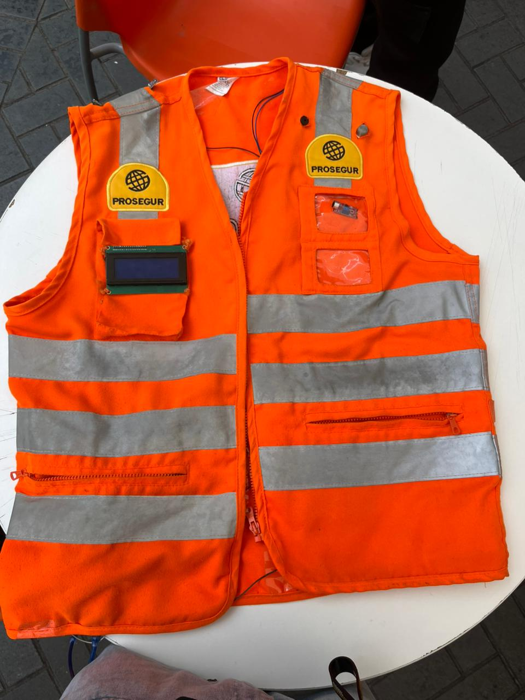

# Sistema de Monitoreo Ambiental IoT

Este proyecto consiste en el desarrollo de un sistema de monitoreo ambiental utilizando tecnología IoT para medir niveles de CO2 y radiación UV.

##  Tecnologías Utilizadas
* Arduino
* Sensores CO2
* Sensor UV
* C++
* IoT

##  Arquitectura del Sistema

##  Funcionalidades
* Monitoreo de calidad del aire
* Medición de radiación UV
* Alertas ambientales
* Visualización de datos

##  Objetivo del Proyecto
Desarrollar una solución tecnológica que permita monitorear condiciones ambientales en tiempo real.

##  Estructura del Proyecto

* `/arduino_code.ino` : Código principal
* `/diagrama_iot.png` : Diagrama del sistema
* `/documentacion.pdf` : Documentación del proyecto
